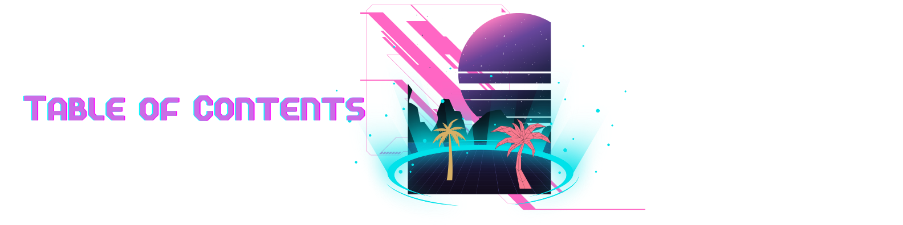
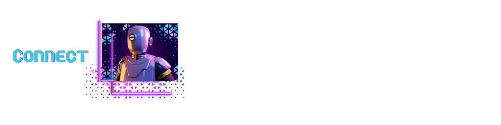
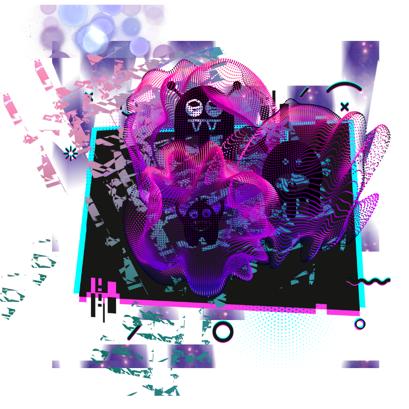

  

### 
  <!-- - [OVERVIEW](#overview)
    - [*gremlin-list*](#gremlin-list)
  - [INSTALLATION](#installation)
  - [USAGE](#usage)
    - [*demo*](#demo)
  - [SOURCES](#sources)
  - [LICENSE](#license)
  - [LINKS](#links) -->
  - [CONNECT](#connect)

#

#

### 

<!-- 

 -->
